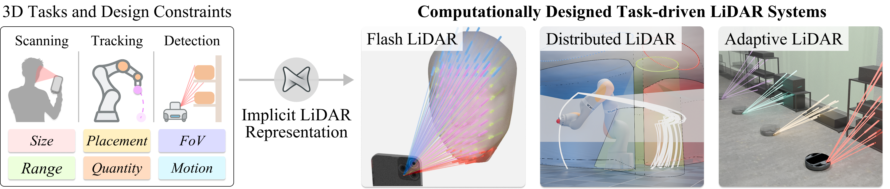

# Task-Driven Implicit Representations for Automated Design of LiDAR Systems

<p align="center">
  
</p>

<p align="center">
  <a href="https://nikhilbehari.github.io/implicitlidar/"><b>Project page</b></a>
  &nbsp;·&nbsp;
  <a href="https://nikhilbehari.github.io/implicitlidar"><b>Paper</b></a>
</p>

> Behari, N., Young, A., Klinghoffer, T., Dave, A., & Raskar, R.
> *Task-Driven Implicit Representations for Automated Design of LiDAR Systems.*
> CVPR 2026.

LiDAR system design, choosing how many sensors to use, where to place
them, what field of view they should have, and how to time-gate their
detectors, is a complex, largely manual process. We represent LiDAR
configurations in a continuous **6D design space**
`(x, y, z, φ, ψ, τ)` and learn task-specific implicit densities over
this space via flow-based generative modeling. New LiDAR systems are
then synthesized by modeling sensors as parametric distributions in 6D
and fitting them to the learned density via expectation–maximization,
enabling efficient, constraint-aware LiDAR system design.

## Workflow

Every experiment runs the same pipeline; the task scene and the
design-space constraints come from the YAML config.

```
1. prepare      build the dataset for the task         python -m implicitlidar.experiments.<expt>.prepare      (face_scanning, warehouse_detection)
2. train        fit the implicit density               python -m implicitlidar.experiments.<expt>.train
3. synthesize   fit a sensor mixture (EM) to it        python -m implicitlidar.experiments.<expt>.synthesize
4. evaluate     simulate the design and score it       python -m implicitlidar.experiments.<expt>.evaluate
```

Concretely, for the warehouse-detection experiment:

```bash
# 1. Prepare
python -m implicitlidar.experiments.warehouse_detection.prepare --out outputs/data/warehouse

# 2-4. Train, synthesize, evaluate
python -m implicitlidar.experiments.warehouse_detection.train      --config implicitlidar/experiments/warehouse_detection/configs/default.yaml
python -m implicitlidar.experiments.warehouse_detection.synthesize --config implicitlidar/experiments/warehouse_detection/configs/default.yaml
python -m implicitlidar.experiments.warehouse_detection.evaluate   --config implicitlidar/experiments/warehouse_detection/configs/default.yaml
```

Numerical results land in `outputs/runs/<experiment>/results/*.csv`.

## Install

Python 3.10+ and a CUDA-capable GPU (recommended, falls back to CPU).
Everything installs via `pip` from `pyproject.toml`:

```bash
git clone https://github.com/NikhilBehari/implicitlidar.git
cd implicitlidar
conda create -n implicitlidar python=3.11 -y
conda activate implicitlidar

# Base install: face_scanning, warehouse_detection, real_world
pip install -e .

# Optional extras (install only what you need)
pip install -e ".[robot]"      # robot_tracking      (mujoco, pytorch_kinematics, pybullet)
pip install -e ".[emitter]"    # emitter_design      (mitsuba 3, mitransient)
pip install -e ".[dev]"        # linters, jupyter, pytest
```

Verify the install:

```bash
pytest -q
```

The KUKA IIWA 14 model
([MuJoCo Menagerie](https://github.com/google-deepmind/mujoco_menagerie),
Apache 2.0) and the Mitsuba scene template for the emitter-design
experiment are vendored under [`assets/`](assets/); see
[`assets/README.md`](assets/README.md) for attribution.

## Experiments

Each experiment lives under
[`implicitlidar/experiments/`](implicitlidar/experiments) and is
self-contained. Run its README's prepare / train / synthesize / evaluate
commands, or run the end-to-end driver:

```bash
bash run_all.sh
```

| Experiment | Task |
|---|---|
| [`face_scanning`](implicitlidar/experiments/face_scanning) | Smartphone flash-LiDAR design for 3D face mesh reconstruction (Basel Face Model). |
| [`robot_tracking`](implicitlidar/experiments/robot_tracking) | Distributed ceiling-mounted LiDAR design for end-effector tracking (KUKA IIWA in MuJoCo); a paired config toggles the visibility term for the occlusion ablation. |
| [`warehouse_detection`](implicitlidar/experiments/warehouse_detection) | Motion-adaptive scanning design for warehouse object detection. |
| [`emitter_design`](implicitlidar/experiments/emitter_design) | Constraint-aware emitter synthesis for a fixed detector, evaluated by Mitsuba 3 transient rendering. |
| [`real_world`](implicitlidar/experiments/real_world) | Real single-photon LiDAR mesh reconstruction using designs synthesized in `face_scanning`. |

## Layout

```
implicitlidar/
├── README.md
├── implicitlidar/             the Python package
│   ├── core/                      core methodology (target density, flow, EM, constraints)
│   ├── scenes/                    per-task SDF construction (faces, robot arm, warehouse)
│   ├── eval/                      ray intersection, reconstruction, metrics
│   ├── utils/                     config loading, GPU selection, I/O
│   └── experiments/               per-experiment train / synthesize / evaluate
├── assets/                    shared resources (KUKA model, Mitsuba scene, README figures)
├── tests/                     unit tests for the core methodology and metrics
├── docs/                      project page (GitHub Pages)
├── run_all.sh                 end-to-end driver across all experiments
└── outputs/                   datasets and run outputs (gitignored)
    ├── data/                      built by `<expt>.prepare`
    └── runs/                      per-experiment train / synthesize / evaluate outputs
```

[`implicitlidar/core/`](implicitlidar/core) holds the methodology;
[`implicitlidar/experiments/<name>/`](implicitlidar/experiments)
composes it with task-specific scenes and metrics.

## Citation

```bibtex
@inproceedings{behari2026implicitlidar,
  title     = {Task-Driven Implicit Representations for Automated Design of LiDAR Systems},
  author    = {Behari, Nikhil and Young, Aaron and Klinghoffer, Tzofi and Dave, Akshat and Raskar, Ramesh},
  booktitle = {Proceedings of the IEEE/CVF Conference on Computer Vision and Pattern Recognition (CVPR)},
  year      = {2026},
}
```

## Acknowledgments and license

This repository builds on the open-source work of
[normflows](https://github.com/VincentStimper/normalizing-flows),
[pytorch_volumetric](https://github.com/UM-ARM-Lab/pytorch_volumetric),
[pytorch_kinematics](https://github.com/UM-ARM-Lab/pytorch_kinematics),
[MuJoCo Menagerie](https://github.com/google-deepmind/mujoco_menagerie),
[Mitsuba 3](https://github.com/mitsuba-renderer/mitsuba3), and
[mitransient](https://github.com/diegoroyo/mitransient).

Released under the [MIT License](LICENSE).
